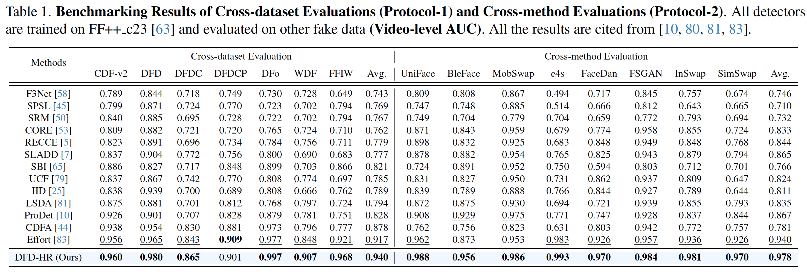

<a id="top"></a>

# DFD-HR: Generalizable Deepfake Detection via Hierarchical Routing Learning

[](https://creativecommons.org/licenses/by-nc/4.0/)


📄 **Paper:** [DFD-HR](https://openaccess.thecvf.com/content/CVPR2026/papers/Sun_DFD-HR_Generalizable_Deepfake_Detection_via_Hierarchical_Routing_Learning_CVPR_2026_paper.pdf) &nbsp;|&nbsp; 💾 **Checkpoints:** [Google Drive](https://drive.google.com/file/d/1ZZa0ZSOsam6KQ7YdAu5Uwkbkp0joqs4H/view?usp=drive_link)

> 🎉🎉🎉 **Our paper has been accepted by CVPR2026 🏆!**

---

## 📑 Table of Contents

- [Introduction](#-introduction)
- [Quick Start](#-quick-start)
  - [1. Installation](#1-installation)
  - [2. Data Preparation](#2-data-preparation)
  - [3. Download Checkpoints](#3-download-checkpoints)
  - [4. Training](#4-training)
  - [5. Testing](#5-testing)
- [Citation](#-citation)

---

## 🧭 Introduction

Welcome to our work **DFD-HR**, for detecting deepfake images.

In this work, we propose:

1. A **very very easy and effective method** for generalizable AIGI detection 😀
2. A **novel analysis tool** for quantifying the *"degree of model's overfitting"* 😊

The figure below provides a brief introduction to our method: it can be **plug-and-play inserted** into *any* ViT-based large models such as CLIP.
For **the corresponding implementation details**, please see [`dfd_hr_detector.py`](https://github.com/Disguiser15/DFD-HR/blob/main/training/detectors/dfd_hr_detector.py).

<p align="center">
  
</p>

The following table displays **part of the results** of our method on **the deepfake detection benchmark**. Please refer to our paper for more results.

<p align="center">
  
</p>

---

## ⏳ Quick Start

<a href="#top">[Back to top]</a>

### 1. Installation

Please run the following script to install the required libraries:

```bash
sh install.sh
```

### 2. Data Preparation

- **Download datasets:** If you want to reproduce the results of each deepfake dataset, you can download the processed datasets (already preprocessed via frame extraction and face cropping) from [DeepfakeBench](https://github.com/SCLBD/DeepfakeBench). For evaluating more diverse fake methods (such as SimSwap, BlendFace, DeepFaceLab, etc.), you are recommended to use the recently released [DF40 dataset](https://github.com/YZY-stack/DF40) (with 40 distinct forgery methods implemented).
- **Preprocessing (optional):** If you only want to use the processed data we provided, you can skip this step. Otherwise, you need to perform **data preprocessing strictly following DeepfakeBench**.
- **Rearrangement (optional):** *"Rearrangement"* means that we need to **create a JSON file for each dataset that collects all frames within different folders**. Please refer to **DeepfakeBench** and **DF40** for the provided JSON files for each dataset. After running the rearrangement step, you will obtain the JSON files for each dataset in the `./preprocessing/dataset_json` folder. The rearranged structure organizes the data hierarchically, grouping videos based on their labels and data splits (*i.e.,* train / test / validation). Each video is represented as a dictionary entry containing relevant metadata, including file paths, labels, compression levels (if applicable), *etc*.

### 3. Download Checkpoints

The checkpoint of **"CLIP-L14 + our DFD-HR"** *trained on FaceForensics++* is released on [Google Drive](https://drive.google.com/file/d/1ZZa0ZSOsam6KQ7YdAu5Uwkbkp0joqs4H/view?usp=drive_link).

### 4. Training

You can run the following commands to train the model:

**For multiple GPUs:**

```bash
python3 -m torch.distributed.launch --nproc_per_node=4 training/train.py \
    --detector_path ./training/config/detector/dfd_hr.yaml \
    --train_dataset FaceForensics++ \
    --test_dataset Celeb-DF-v2 \
    --ddp
```

**For a single GPU:**

```bash
python3 training/train.py \
    --detector_path ./training/config/detector/dfd_hr.yaml \
    --train_dataset FaceForensics++ \
    --test_dataset Celeb-DF-v2
```

### 5. Testing

Once you finish training, you can test the model on several deepfake datasets such as DF40:

```bash
python3 training/test.py \
    --detector_path ./training/config/detector/dfd_hr.yaml \
    --test_dataset Celeb-DF-v2 FaceShifter DeepFakeDetection DFDC DFDCP \
                   test_DFR test_WDF test_FFIW \
                   uniface_ff blendface_ff mobileswap_ff e4s_ff \
                   facedancer_ff fsgan_ff inswap_ff simswap_ff \
    --weights_path ./logs/dfd-hr/weights/{CKPT}.pth
```

You can then obtain evaluation results similar to those reported in our manuscript.

<a href="#top">[Back to top]</a>

---

## 📕 Citation
If you find our work helpful to your research, please consider citing our paper as follows:
```
@InProceedings{Sun_2026_CVPR,
    author    = {Sun, Jiamu and Yan, Zhiyuan and Zhang, Ke-Yue and Yao, Taiping and Ding, Shouhong},
    title     = {DFD-HR: Generalizable Deepfake Detection via Hierarchical Routing Learning},
    booktitle = {Proceedings of the IEEE/CVF Conference on Computer Vision and Pattern Recognition (CVPR)},
    month     = {June},
    year      = {2026},
    pages     = {13984-13995}
}
```